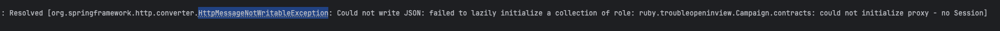

# [Spring] JPA 에서 open-in-view 를 false 로 해야 하는 이유 + 엔티티
몇 달 전 다른 회사에서 개발된 프로젝트를 인수받아 SM 업무를 맡게 되었습니다.
인수받은 프로젝트는 Spring JPA 를 사용한 프로젝트였는데 테스트를 하던 중 조회 부분에서 필요 이상으로 과도하게 데이터가 조회되고 있는 현상이 발견되었습니다.
캠페인 정보를 요청했는데 캠페인에 속한 청약 및 청약의 타겟 정보들까지 추가로 조회되고 있었던 것입니다.
로그를 확인해 본 결과 응답 결과를 보내는 시점에 조회 쿼리가 추가로 발생, N+1 문제가 발생하고 있었습니다.


## JPA 의 영속성 컨텍스트와 open-in-view
**영속성 컨텍스트(Persistence Context)** 는 엔티티 객체를 저장하고 관리하는 환경입니다.
주요 역할 중 하나로 엔티티의 생명주기를 관리하는 역할을 담당하는데 **open-in-view** 의 설정 값에 따라 컨텍스트가 열려있는 범위, 즉 엔티티를 관리하는 범위가 달라지게 됩니다.

| 설정                   | 영속성 컨텍스트 유지 범위                          | Lazy Loading | 트랜잭션 종료 후 영속성 컨텍스트 상태         |
|-----------------------|----------------------------------------------|--------------|--------------------------------------|
| open-in-view=true     | HTTP 요청 시작부터 끝까지 (View 포함)              | 가능          | 유지됨                                 |
| open-in-view=false    | Service 계층 내에서 트랜잭션 범위 내로 제한          | 불가능         | 종료됨                                 |

open-in-view 의 기본 값은 true 이며 다음과 같이 설정할 수 있습니다.
```yaml
spring:
  jpa:
    open-in-view: false # 또는 true
```

## 그래서 N+1 문제가 발생한 이유가 무엇인가?
```kotlin
@Entity
class Campaign(

    @Id
    @GeneratedValue(strategy = GenerationType.IDENTITY)
    var id: Long? = null,

    @Column(nullable = false)
    val name: String,

    @OneToMany(mappedBy = "campaign", cascade = [CascadeType.ALL], orphanRemoval = true, fetch = FetchType.LAZY)
    @JsonIgnoreProperties("campaign")
    val contracts: MutableList<Contract> = mutableListOf()
)

@Service
class CampaignService(val campaignRepository: CampaignRepository) {

    fun getAllCampaigns(): List<Campaign> {
        return campaignRepository.findAll()
    }
}

@RestController
@RequestMapping("/campaigns")
class CampaignController(
    private val campaignService: CampaignService
) {

    @GetMapping
    fun getAllCampaigns(): List<Campaign> {
        return campaignService.getAllCampaigns()
    }
}
```

코드를 살펴보면 단순히 캠페인 목록만 조회만 하고 캠페인 엔티티 List 를 반환, 겉으로 보기에는 캠페인 엔티티 외에 연관된 엔티티를 접근하지 않는 것처럼 보입니다.
그러나 실제로는 응답 처리 과정에서 HttpMessageConverter 가 반환 데이터를 직렬화 하면서 엔티티의 모든 필드에 접근을 시도하게 되는데 이 시점에 원치 않은 지연로딩 및 데이터 응답이 발생하게 됩니다.
```json
[
  {
    "id": 1,
    "name": "캠페인 0",
    "contracts": [
      {
        "id": 1,
        "title": "캠페인 0 - 청약 0",
        "targets": [
          {
            "id": 1,
            "target": {
              "id": 6,
              "name": "부천"
            }
          },
          {
            "id": 2,
            "target": {
              "id": 7,
              "name": "세종"
            }
          }
          ...
        ]
      },
    ...
  },
  ...
],
```

## open-in-view=false 만으로 충분하지 않다
위의 현상을 막기 위해서 일단 open-in-view 를 false 로 설정하기로 결정하였습니다. 그러나 막상 애플리케이션을 실행, 요청을 테스트한 결과 다른 문제가 발생하였습니다.

